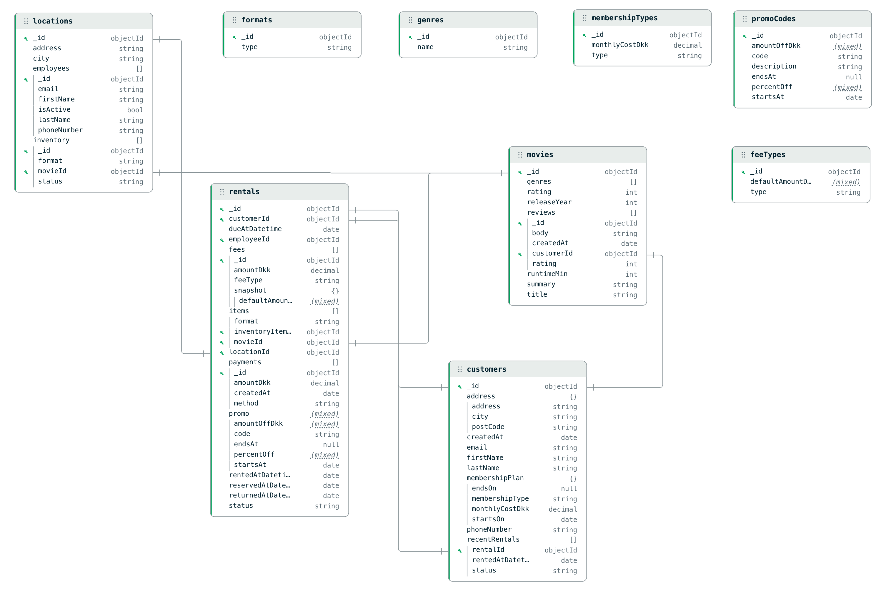

# 🎬 Movie Rental Database


A movie rental system based on a vintage physical rental store.  
The project models customers, rentals, inventory, staff, payments, and overdue handling.

It is designed to demonstrate how the same domain can be implemented across three databases:

- **MySQL** for the structured, transactional rental workflow  
- **MongoDB** for flexible, document-oriented data  
- **Neo4j** for graph-based relationships such as customers, genres, and connections

Each database has its own API:

- `/api/v1/mysql/*`
- `/api/v1/mongodb/*`
- `/api/v1/neo4j/*`

The goal is to showcase practical, side-by-side implementations using ORM/ODM/OGM patterns, all containerized with Docker.

---

## Database Design – MySQL ER Diagram

The core relational model for the project is captured in an Entity–Relationship (ER) diagram.  
It shows how customers, rentals, inventory, payments, memberships, and fees are connected in the MySQL schema.


---


## Database Design – MongoDB Document Model

The MongoDB data model is captured in a document model diagram.  
It shows how collections, embedded documents, and references represent the same domain in a document-oriented way.



---

## API Documentation (Swagger / OpenAPI)

Interactive API docs are available after starting the Flask app:

- Swagger UI: `http://127.0.0.1:5004/api/v1/docs`
- Raw OpenAPI YAML: `http://127.0.0.1:5004/openapi/v1.yaml`

---

## Quick Start (Docker - Recommended)

### Prerequisites
- [Docker Desktop](https://www.docker.com/products/docker-desktop/) installed and running  
- Git  
- Python 3.10+ (for the API layer)

> Python/virtualenv are only needed if you want to run the API directly on your host.  
> For the Docker setup below, everything runs in containers.

## Setup (local)

Run the Flask API on your machine, MongoDB and MySQL in Docker.

```bash
# 1. Clone the repository
git clone https://github.com/DBD-Movie-Rental/movie-rental-main.git
cd movie-rental-main

# 2. Create and activate virtual environment
python3 -m venv .venv
source .venv/bin/activate

# 3. Install dependencies
pip install -r requirements.txt

# 4. Start MySQL + MongoDB containers (in Docker)
# IMPORTANT: MongoDB requires a keyfile with restricted permissions for replica sets.
# Run this command once before starting:
chmod 400 database/mongodb/replica.key

docker compose -f compose/docker-compose.dev.yml up -d mysql mongodb

# 5. Run the migration script (from your local shell)
python3 -m migrations.migrate_sql_to_mongo

# 6. Start the Flask API locally
python3 -m src.app
```

API will be available at: `http://127.0.0.1:5004`  
MySQL will be available at: `127.0.0.1:3307` (user: `app`, password: `app`, db: `movie_rental`)

Swagger UI: `http://127.0.0.1:5004/api/v1/docs`  
OpenAPI Spec: `http://127.0.0.1:5004/openapi/v1.yaml`


## Setup (Docker – API + MySQL + MongoDB)

Run both the API, MySQL and MongoDB inside Docker.

```bash
# 1. Clone the repository
git clone https://github.com/DBD-Movie-Rental/movie-rental-main.git
cd movie-rental-main

# 2. Built docker compose and run
chmod 400 database/mongodb/replica.key
docker compose -f compose/docker-compose.dev.yml up --build -d

# 3. Run mysql --> mongodb migration from api container
docker compose -f compose/docker-compose.dev.yml exec api python -m migrations.migrate_sql_to_mongo

# 3. (Optional) Check running containers
docker ps
```

API: `http://127.0.0.1:5004/api/v1/health`  
MySQL: `127.0.0.1:3307`

Swagger UI: `http://127.0.0.1:5004/api/v1/docs`

## Seeding the MySQL Database

If you want **more realistic demo data** (dozens of customers, movies, rentals, reviews, etc.), you can run the Python seeder.

The seeder:

- Uses the same **SQLAlchemy engine** as the API.
- Reads CSV/TXT files from `seed/data/`:
  - `customers.csv`
  - `employees.csv`
  - `locations.csv`
  - `movies.csv`
  - `promo_codes.csv`
  - `reviews.txt`
  
Make sure Docker stack is running
```bash
python3 -m seed.mysql_seed
```

## Docker build only

If you just want to (re)build images without starting containers:

```bash
docker compose -f compose/docker-compose.dev.yml build
```

---

## 👥 Authors

- **Christian B. Thellefsen**  
  [](https://github.com/ChristianBT96)

- **Marcus R. Kjærsgaard**  
  [](https://github.com/marcus-rk)
